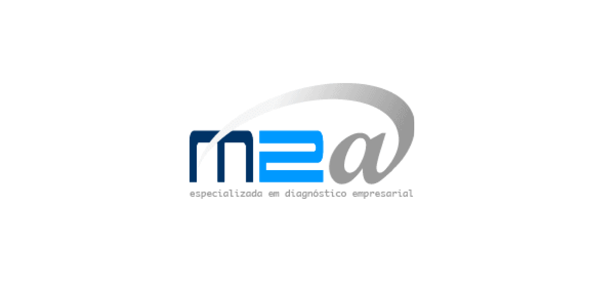
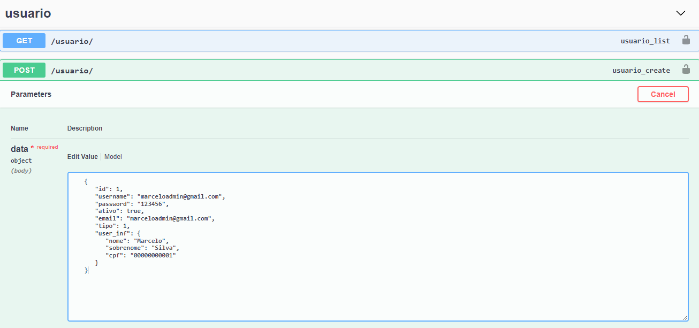

<!-- PROJECT LOGO -->
<h1 align="center">
<br>
  <a href="">
    
  </a>
<br>
<br>
M2A
</h1>

<!-- ABOUT THE PROJECT -->

## 💡 Sobre o Projeto

Este projeto trata-se de uma aplicação, onde empresas podem utilziar para responder um questionário, e consultores irão avaliar o potencial de risco desta empresa, entregando uma devolutiva de como a mesma pode evoluir, baseado nas respostas deste questionário.

<!-- TECHNOLOGIES -->

## 🚧 Feito Com

Segue abaixo o que foi utilizado na criação deste aplicativo:

- ⚛️ [React](https://pt-br.reactjs.org/)
- 🐋 [Firebase](https://www.docker.com/)
- 🐍 [Django REST Framework](https://www.django-rest-framework.org/)

## 🔨 Instalação

Para rodar o projeto localmente em sua máquina, você precisa rodar o back-end, o front-end e alimentar o servidor com alguns dados. Siga estes passos:

### Back-end:

1 - Instale o [Docker](https://www.docker.com/) em sua máquina. <br/>
2 - Busque a imagem 983515929/gabriel_api.

```
docker pull 983515929/gabriel_api
```

3 - Rode o compose.

```
docker-compose up
```

Pronto o back-end está rodando localmente via docker.

### Front-end:

1 - Instale o NPM. <br/>
2 - Rode o npm install.

```
npm install
```

2 - Inicie o servidor node front-end.

```
npm start
```

Pronto o front-end está rodando localmente utilizando ReactJS.

### Alimentando o back-end:

Na raiz do projeto existe um arquivo de nome `users.json`, que contém um array com alguns usuários. Com este arquivos em mãos, você acessará `http://localhost:8000/swagger/` e realizará um POST em ​`/usuario​/`, para cada um dos itens do array de `users`.<br/>
Exemplo:


<br/>
Após isto você deverá popular o back-end com as perguntas, para isto basta ir até o arquivo `/src/routes/Router.tsx` e decomentar a linha:

```
// dispatch(GeneralActions.seedBackend());
```

Dê um refresh onde está rodando o front-end (`http://localhost:3000/`), e comente esta linha novamente, senão ele vai gerar 30 perguntas a cada refresh na página.

Pronto! O projeto está pronto para uso!

<!-- DEMONSTRATION -->

<!-- ## :alembic: Demonstração

Para ilustrar melhor o projeto, abaixo estão algumas demonstrações:

### Login/Registro


### Feed

 -->

<!-- CONTACT -->

<!-- ## :speech_balloon: Contato -->

<!-- 🔘 LinkedIn - [Clique Aqui](https://www.linkedin.com/in/vitormachado-code/) -->
